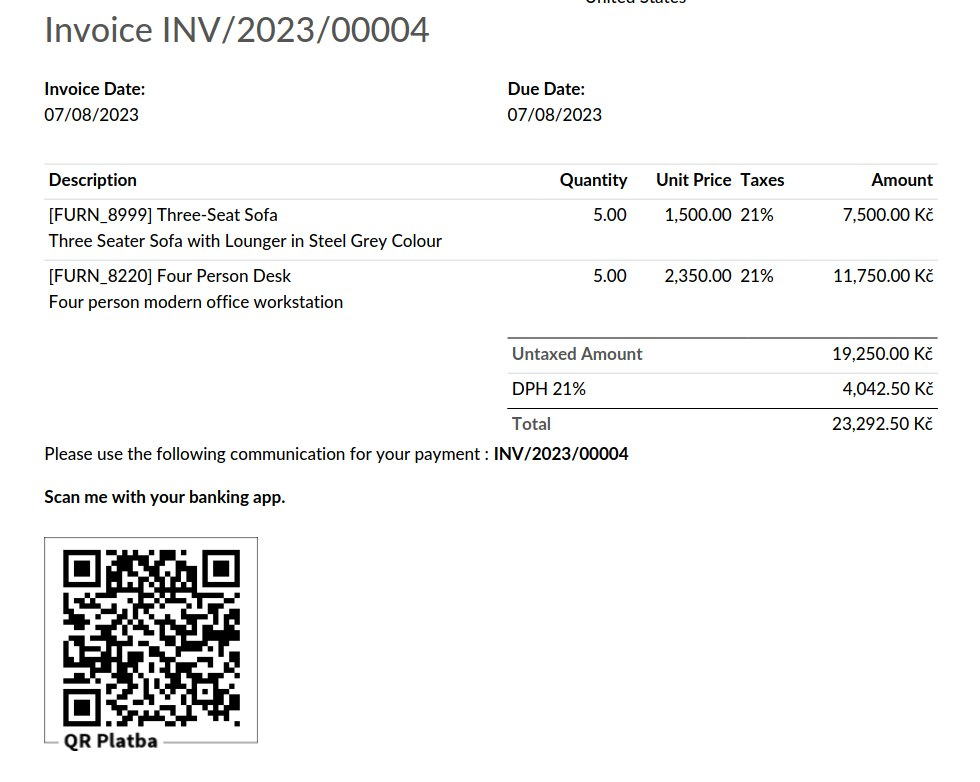

================================
Account QR Code QR Platba CZ
================================

.. raw:: html

   

.. |badge1| image:: https://raster.shields.io/badge/license-Other_proprietary-blue.png
    :alt: License: Other proprietary

|badge1| 

| The module adds Czech Republic Credit Transfer QR-code to reports.
| It is an offline generator and does not depend on external services.

**Table of contents**

.. contents::
   :local:

Usage
=====

#. Go to *Settings > Invoicing > Customer Payments*
#. Enable QR codes
#. Go to any invoice *Other info > Payment QR-code > QR Platba (Czech Republic)*

   

Author
======

* Data Dance s.r.o.

Contact
=======
https://www.datadance.eu/