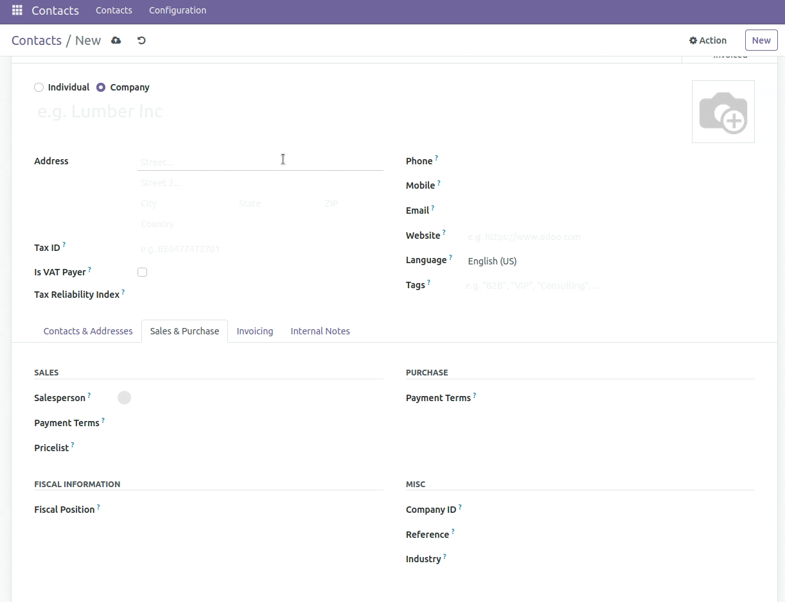

============================================
Partner Autocomplete Ares CZ
============================================

.. raw:: html

   

.. |badge1| image:: https://raster.shields.io/badge/license-Other_proprietary-blue.png
    :alt: License: Other proprietary

|badge1| 

| Completes Partner information using ARES from https://wwwinfo.mfcr.cz/
|
| Availiable countries

#. Czech Republic

| Information that can be completed:

#. Address
#. Tax ID
#. Dynamically mappable fields (see Configuration point 4.):
    * Company identification number

**Table of contents**

.. contents::
   :local:

Configuration
=============

#. Go to *Settings > General Settings > Contacts*
#. Enable *Partner Autocomplete*
#. Choose provider ARES.cz
#. Choose fields for mapping (optional)

|
| Dynamically mappable fields are used to paste data from ARES.cz to any field in Contact(res.partner) model.

Autocomplete During Import
==========================

#. Create import file with columns: *name* and  *import_enrich_company* (it can have other columns as well)
#. In the *import_enrich_company* column, enter *CIN*
#. Import the file

Manual Update of Records
=========================

#. Go to *Contacts*
#. Switch to the list view
#. Select records you want to update
#. Click *Action > Update*

Usage
=====

Author
======

* Data Dance s.r.o.

Contact
=======
https://www.datadance.eu/